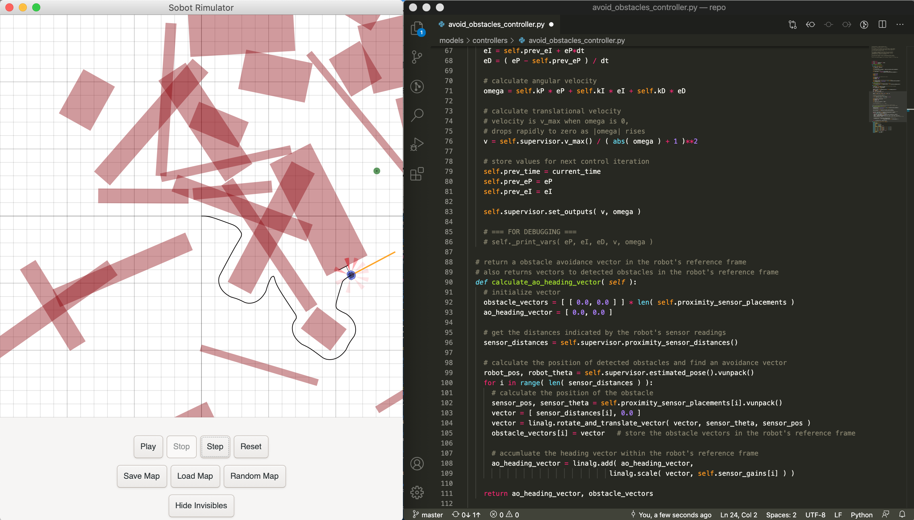
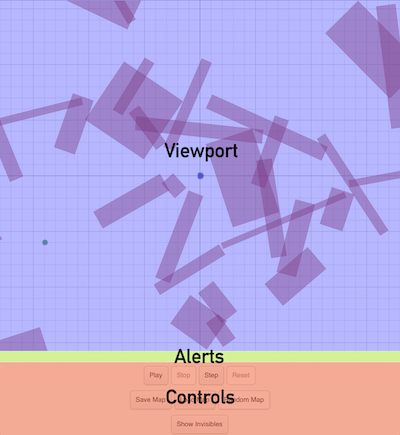
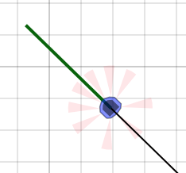
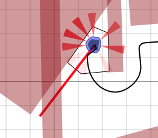
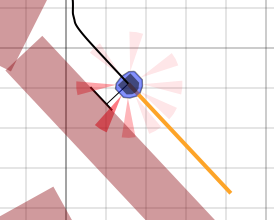
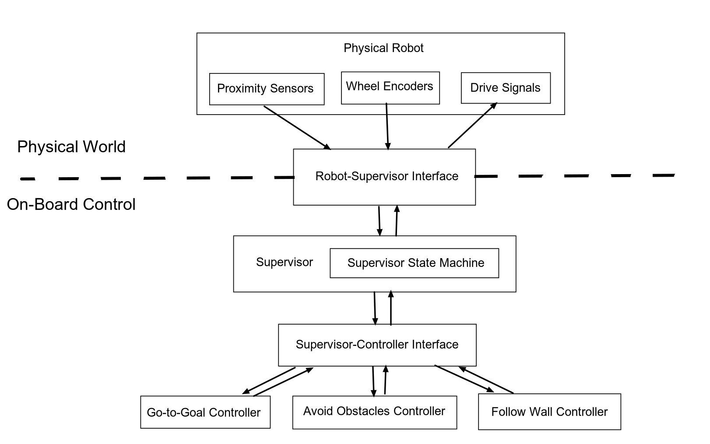

**ARCHIVED: Please note that this repository is not currently maintained.**

# Sobot Rimulator

A robot programming tool.



Sobot Rimulator is inspired by [Sim.I.Am](http://jpdelacroix.com/software/simiam.html), by [JP de la Croix](http://jpdelacroix.com/). The software simulates a [Khepera III](https://ftp.k-team.com/KheperaIII/UserManual/Kh3.Robot.UserManual.pdf) robot navigating to a goal in an environment of obstacles. The control system packaged with this software is based on the principles of [hybrid automata](https://en.wikipedia.org/wiki/Hybrid_automaton), as taught by [Magnus Egerstedt](https://magnus.ece.gatech.edu/). An in-depth discussion of these principles is given in [this article](https://www.toptal.com/robotics/programming-a-robot-an-introductory-tutorial) on the Toptal Engineering Blog.

## Table of Contents

- [Getting Started](#getting-started)
- [User Interface](#user-interface)
- [Robot Control System Overview](#robot-control-system-overview)
- [Swarm Force Behavior](#swarm-force-behavior)

## Getting Started

### Requirements

Sobot Rimulator requires Python 3 (>= 3.10) and [Gtk 3](https://www.gtk.org/)
with [PyGObject 3](https://pygobject.readthedocs.io/en/latest/index.html) for
the UI. PyGObject is the only Python runtime dependency; it needs the system
GTK3 / gobject-introspection development packages to install.

See [docs/installation.md](docs/installation.md) for the full installation
procedure (both `uv` and `pip` + `venv` paths), the required system packages,
and how to run the tests.

### Running the Simulator

From the command line, navigate to the project's root directory. Then type:

```
uv run python simulator.py
```

(or `python simulator.py` inside an activated virtual environment).

Note: the simulator is a GTK application and requires a display; without one
it exits at startup. The test suite does not require a display.

## User Interface

The simulator interface contains the following elements:

- [Simulation Viewport](#simulation-viewport)
- [Alert Text Panel](#alert-text-panel)
- [Control Panel](#control-panel)



### Simulation Viewport

When the program starts, a randomized map is loaded.

A small blue and black circular object in the center of the viewport is the robot. The dimensions and capabilities of this robot are modeled after the [Khepera III](https://ftp.k-team.com/KheperaIII/UserManual/Kh3.Robot.UserManual.pdf) research robot. The Khepera III is a differential-drive mobile robot. It is equipped with 9 infrared proximity sensors forming a "skirt," with which it can detect nearby obstacles.

A green circle indicates the location of the goal the robot will attempt to reach.

Red rectangles scattered throughout the map are obstacles - if the robot makes contact with an obstacle, a collision will occur and the simulation will end.

A grid is drawn onto the map to help you judge distances. Major gridlines are laid out every meter. Minor gridlines are laid out every 20 centimeters.

### Alert Text Panel

When events such as a collision or successful arrival at the goal occur, it will be reported in the space between the simulation view port and the control panel. When the simulation begins, the alert text panel is blank.

### Control Panel

The control panel is divided into three rows.

The first row of buttons controls the simulation progress:

- **"Play"** - Causes the simulation to proceed until you stop it, or the robot reaches the goal or collides with an obstacle.

- **"Stop"** - Stops the simulation in its current state.

- **"Step"** - Advances the simulation by one simulation cycle. The simulation will be stopped after this button is pressed.

- **"Reset"** - Clears all progress of the robot and resets the simulation.

The second row of buttons gives you control over the map:

- **"Save Map"** - Opens a save dialog. The default location to save maps is in the `/maps` folder of the simulator directory. Saving a map will NOT save the current state of the simulation. It only saves the location of the obstacles and the goal.

- **"Load Map"** - Opens a load dialog. From here you can load previously saved maps.

- **"Random Map"** - Generates a random map on the fly. The simulation resets when a new random map is generated.

The third row of buttons provides a more detailed visualization of what the robot is doing:

- **"Show Invisibles"** - Causes extra information to be drawn to the simulation view that would not be visible in the real world. This includes the robot's traverse path (where it has been so far), the robot's infrared sensor cones, the robot's current desired heading, and other information specific to the current control mode of the robot:

  - A green heading bar indicates that the robot is currently in **Go to Goal** mode.

    

  - A red heading bar indicates that the robot is currently in **Avoid Obstacles** mode. This will be accompanied by a black outline indicating the robot's detected surroundings.

    

  - An orange heading bar indicates that the robot is currently in **Follow Wall** mode. This will be accompanied by two black lines - one indicating the followed surface calculated by the robot, and another indicating the stand-off distance to that obstacle surface.

    

## Robot Control System Overview

Following is a brief overview of the robot control implementation that comes with this software. You are encouraged to play with this code and experiment with different implementations.

The simulated robot's "on-board" control code is found in the `robot_control/` folder.

The below diagram gives a high-level conceptual overview of the relationship between different components at runtime. Arrows represent the direction that information flows. In general, downward arrows carry information about the robot's current state, while upward arrows carry information about the robot's desired next state.



### Robot-Supervisor Interface

The robot is controlled by a supervisor. Instead of talking directly to the simulated "physical" robot, a supervisor is given a `RobotSupervisorInterface` (`robot_supervisor_interface.py`) that defines the entirety of available commands the supervisor can send the robot. The `RobotSupervisorInterface` can be thought of as an API to the robot, providing these instructions:

  - `read_proximity_sensors()`
  - `read_wheel_encoders()`
  - `set_wheel_drive_rates(velocity_left, velocity_right)`

### Supervisor

The `Supervisor` (`supervisor.py`) is the brains of the robot. It contains a `RobotSupervisorInterface`, a `SupervisorStateMachine` that manages control state transitions, and several different controllers that can generate control parameters by various criteria. It also contains odometry code for maintaining an estimate of the robot's current position and heading. The `Supervisor` control-loop sequence is as follows:

  1. **Update State** - update sensor readings, odometry, and controller headings; update the `SupervisorStateMachine` based on the new readings; set new active controller based on the new control state

  1. **Execute Controller** - generate new control parameters using the active controller and the current sensor readings

  1. **Send Commands** - apply the new control parameters to the robot by sending the appropriate robot commands

### Supervisor State Machine

The `SupervisorStateMachine` (`supervisor_state_machine.py`) manages the robot's control state. The version distributed with Sobot Rimulator supports the following control states (defined in `control_state.py`):

  - `ControlState.AT_GOAL`
  - `ControlState.GO_TO_GOAL`
  - `ControlState.AVOID_OBSTACLES`
  - `ControlState.GTG_AND_AO`
  - `ControlState.SLIDE_LEFT`
  - `ControlState.SLIDE_RIGHT`

Once per control loop iteration, the `SupervisorStateMachine` updates itself. It first checks if certain conditions are met (e.g., sensors indicate that an obstacle is very close). Depending on the set of conditions that are met, the state machine may then transition the control state to a new state. A state transition will usually include changing the active controller used by the `Supervisor`.

### Supervisor-Controller Interface

The `SupervisorControllerInterface` (`supervisor_controller_interface.py`) serves as a thin wrapper around the `Supervisor` to simplify communication between it and its various controllers.

### Controllers

This software comes with five controllers that are available to the `Supervisor`:

- `GoToGoalController` (`go_to_goal_controller.py`)
- `AvoidObstaclesController` (`avoid_obstacles_controller.py`)
- `FollowWallController` (`follow_wall_controller.py`)
- `GoToAngleController` (`go_to_angle_controller.py`)
- `GTGAndAOController` (`gtg_and_ao_controller.py`)

Note that `GoToAngleController` and `GTGAndAOController` are not currently being used in this build, but you may enable them if you'd like to see how they behave. Additional controllers can be added fairly easily.

Before the `SupervisorStateMachine` updates, each controller generates a heading vector. Each heading will likely be different, representing the direction the robot should go to perform the behavior that particular controller is designed to implement. These headings are then compared to each other by the `SupervisorStateMachine` as part of its test for state transitions.

After the `SupervisorStateMachine` has updated the control state, the controller that it chose to activate is executed. The active controller generates movement parameters intended to effectively move the robot towards that controller's heading vector. These parameters are given using the "unicycle model" of movement (i.e. a translational velocity parameter (v) and an angular velocity parameter (omega)). The controller updates the `Supervisor` with these new parameters.

Once the final movement parameters have been calculated and applied, the `Supervisor` will transform them from the "unicycle" model into the corresponding wheel movement rates of a "differential drive" model, and command the robot to drive the wheels using these rates.

## Swarm Force Behavior

The simulator includes a custom swarm behavior implementation (`SwarmForceBehavior`) that enables robots to interact with each other using physics-based forces. This behavior implements a multi-robot system where robots can detect each other, form swarms, and maintain appropriate distances through attraction and repulsion forces.

### Features

#### Robot Detection
- Robots can distinguish between other robots and static obstacles (walls)
- Each robot uses its infrared proximity sensors to detect nearby robots
- The `robot_detection_sensor_array` identifies which sensors are detecting other robots vs. walls
- Robot positions are tracked and shared through the sensor system

#### Lennard-Jones Potential
The swarm behavior uses a **Lennard-Jones potential** to model inter-robot interactions:

- **Repulsion**: When robots are too close (distance < σ = 0.40m), they experience a repulsive force that pushes them apart
- **Attraction**: When robots are far apart (distance > σ = 0.40m), they experience an attractive force that pulls them together
- **Equilibrium**: At the equilibrium distance (σ = 0.40m), attraction and repulsion balance, maintaining optimal spacing

The force is calculated using the standard Lennard-Jones formula:
```
F(r) = 24 * ε * (2*(σ/r)¹² - (σ/r)⁶) / r
```

Where:
- `ε` (epsilon) = 1.0: Depth of the potential well
- `σ` (sigma) = 0.40m: Equilibrium distance where force is zero

#### State Machine

The `SwarmForceBehavior` implements a state machine with three main states:

1. **SEARCH Mode**
   - Active when no robots are detected nearby
   - Robot wanders around exploring the environment
   - Performs random turns periodically to increase exploration coverage
   - Moves forward while searching for other robots
   - Transitions to WAIT mode when a robot is detected
   - Transitions to AVOID_OBSTACLE mode when a wall is encountered

2. **WAIT Mode (Swarm Mode)**
   - Active when robots are detected within sensor range
   - Applies Lennard-Jones forces for attraction/repulsion
   - Combines multiple force vectors:
     - **Proximal vector**: Lennard-Jones attraction/repulsion forces
     - **Alignment vector**: (Currently unused, available for future flocking behaviors)
     - **Goal vector**: (Currently unused, available for goal-seeking behaviors)
     - **Noise vector**: (Currently disabled, available for stochastic behaviors)
   - Automatically returns to SEARCH mode if robots move out of range
   - Still avoids walls/obstacles even when in swarm mode

3. **AVOID_OBSTACLE Mode**
   - Active when walls or static obstacles are detected (not robots)
   - Calculates the safest direction to turn based on sensor readings
   - Only considers obstacles, ignoring robot detections
   - Automatically returns to previous mode once obstacle is cleared

#### Obstacle Avoidance

The behavior distinguishes between:
- **Robots**: Detected through `robot_detection_sensor_array` - these trigger attraction/repulsion forces
- **Walls/Obstacles**: Detected when sensors read obstacles but `robot_detection_sensor_array` is false - these trigger avoidance behavior

This allows robots to:
- Form swarms with other robots
- Avoid collisions with walls
- Navigate around static obstacles while maintaining swarm cohesion

### Usage

To use the swarm force behavior, robots should be configured with the `SwarmForceBehavior` supervisor. The behavior automatically:
- Detects nearby robots through proximity sensors
- Calculates appropriate forces based on distances
- Transitions between search, swarm, and obstacle avoidance modes
- Maintains safe distances from both robots and obstacles

### Implementation Details

The swarm force behavior is implemented in `robot_control/custom_behavior/swarm_force_behavior.py`. Below are the key functions and their purposes:

#### Main Control Functions

- **`execute()`** (line 78): Main control loop that routes execution to the appropriate state handler based on `current_state`
- **`step(dt)`** (line 74): Called each simulation step to update time and execute the behavior
- **`_update_state()`** (line 286): Updates sensor readings and odometry estimates

#### State Execution Functions

- **`execute_search()`** (line 115): Handles SEARCH mode - checks for robots/obstacles and initiates wandering behavior
- **`execute_wait_in_swarm()`** (line 98): Handles WAIT mode - applies Lennard-Jones forces when robots are detected
- **`execute_avoid_obstacle()`** (line 91): Handles AVOID_OBSTACLE mode - turns away from walls/obstacles
- **`execute_search_wander()`** (line 207): Implements active exploration with random turns during search

#### Force Calculation Functions

- **`calculate_f_vector()`** (line 129): Combines all force vectors (proximal, alignment, goal, noise) into a single resultant force
- **`calculate_proximal_vector()`** (line 153): **Core function** - calculates Lennard-Jones attraction/repulsion forces between robots
  - Iterates through all detected robot neighbors
  - Computes force magnitude using: `F(r) = 24 * ε * (2*(σ/r)¹² - (σ/r)⁶) / r`
  - Returns combined force vector in (x, y) format
- **`calculate_alignment_vector()`** (line 182): Placeholder for future flocking alignment behavior (currently returns zero)
- **`calculate_goal_vector()`** (line 186): Placeholder for goal-seeking behavior (currently returns zero)
- **`calculate_noise_vector()`** (line 189): Placeholder for stochastic noise (currently disabled)
- **`f_to_velocities(f_vector)`** (line 145): Converts force vector to unicycle model velocities (v, omega)

#### Detection Functions

- **`detect_robots_nearby()`** (line 283): Checks if any sensors are detecting other robots
  - Uses `robot_detection_sensor_array` to identify robot detections
- **`detect_obstacle()`** (line 264): Detects walls/obstacles (NOT robots)
  - Only returns True if sensors detect obstacles that are NOT robots
  - Distinguishes between robots and walls using `robot_detection_sensor_array`
- **`_forward_sensor_distances()`** (line 325): Returns distances from forward-facing sensors (indices 1-7)

#### Robot Interface Functions

The behavior interacts with robots through the `RobotSupervisorInterface` (`robot_control/robot_supervisor_interface.py`):

- **`read_robot_neighbors_pose()`** (interface line 22): Returns list of detected robot poses and distances
- **`read_robot_detection_array()`** (interface line 19): Returns boolean array indicating which sensors detect robots
- **`read_proximity_sensors()`** (interface line 7): Returns raw proximity sensor readings
- **`set_wheel_drive_rates(v_l, v_r)`** (interface line 15): Sends wheel velocity commands to robot

#### Helper Functions

- **`turn_to_avoid_obstacle(angle)`** (line 223): Calculates optimal turn direction to avoid obstacles
  - Analyzes sensor readings to find direction with most clearance
  - Only considers obstacles (ignores robot detections)
- **`move_forward()`** (line 204): Simple forward movement command
- **`_send_robot_commands(v, omega)`** (line 292): Converts unicycle velocities to wheel rates and sends to robot
- **`_uni_to_diff(v, omega)`** (line 301): Converts unicycle model to differential drive wheel velocities
- **`_update_odometry()`** (line 330): Updates robot's estimated pose using wheel encoder readings
- **`_update_proximity_sensor_distances()`** (line 361): Updates sensor distance readings and robot detection array

### Configuration

Key parameters that can be adjusted in `SwarmForceBehavior`:

- `epsilon` (default: 1.0): Controls the strength of the Lennard-Jones potential
- `sigma` (default: 0.40m): Equilibrium distance between robots
- `search_wander_interval` (default: 5.0s): Time between random turns during search
- `search_turn_angle` (default: π/3): Angle of random turns during search
- Force vector weights: `a`, `b`, `c`, `d` for proximal, alignment, goal, and noise vectors respectively (defined in `calculate_f_vector()`)
